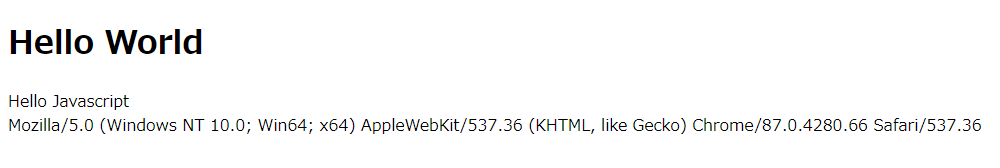

# Docker を使ってリバースプロキシを実装してみた

Docker があればすぐに試せます。

```sh
cd /path/to/docker_reverse_proxy
docker-compose up -d
```

`hosts` ファイルには次を追加してください。

```ini
127.0.0.1 app-a
127.0.0.1 app-b
127.0.0.1 site-c
```

コンテナのビルドが終わったら、ブラウザで `http://site-c` にアクセスしてみてください。

次のように表示されたら成功です！



- `Hello World`
- `Hello Javascript`
- お使いのブラウザの User Agent
